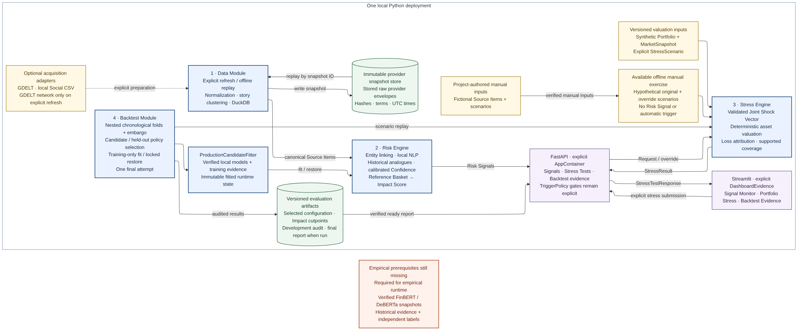

# Financial Risk Engine — S&P Global & Crisil Campus Hackathon

**Candidate Name:** Harsh Upadhyay<br>
**College Email ID:** harsh10.mitmpl2024@learner.manipal.edu<br>
**College / Campus:** Manipal Institute of Technology, Manipal<br>
**Demo Video Link:** Pending final submission<br>
**Slide Deck Link (if hosted externally):** Not hosted externally; a deck is pending final submission.

## 1. Project Overview / Problem Statement & Approach

Financial institutions need to connect fast-moving news and social text to inspectable portfolio risk. This local prototype defines a **Source Item** with provenance, interprets it as an entity-linked **Risk Signal**, and applies a joint **Stress Scenario** to a fictional wholesale-banking **Synthetic Portfolio**. The selected application is strategic portfolio stress testing. The intended full chain includes sentiment, one of eight Event Classes, historical analogues, a portfolio-independent Impact Score, calibrated Confidence, Portfolio Materiality, and Action Priority. These are separate fields with different meanings.

The available demonstration exercises deterministic portfolio valuation from frozen, project-authored hypothetical inputs. It does **not** emit a Risk Signal or establish historical predictive performance. The full offline replay and locked Backtest remain unavailable until authentic model snapshots, licensed historical observations, independently labeled outcomes, and frozen evaluation artifacts are supplied.

## 2. Architecture & Tech Stack

The Python code has four typed module seams: **Data** stores and replays immutable Source Item snapshots; **Risk Engine** links entities, interprets text, matches historical analogues, and estimates Impact and Confidence; **Stress Engine** applies complete factor shocks and attributes revaluation; **Backtest** implements chronological development selection and a locked final evaluation protocol. Financial calculations and policy gates are deterministic. The manual demo calls the production Stress Engine directly with governed hypothetical scenarios.



Open the [full-size architecture PNG](docs/architecture.png) or [diagram source](docs/architecture.mmd).

<details>
<summary>Optional diagram regeneration and PNG metadata</summary>

Regenerate with Mermaid CLI 11.12.0 and Chrome, then restore the PNG text
metadata with Python Pillow. These are optional documentation tools and are not
project runtime dependencies. If Mermaid CLI cannot find local Chrome, supply a
Puppeteer config with its executable path using `mmdc -p`.

```sh
npx --yes --package @mermaid-js/mermaid-cli@11.12.0 mmdc \
  -i docs/architecture.mmd -o docs/architecture.png -w 2000 -s 2 -b white
```

```sh
python - <<'PY'
from hashlib import sha256
from pathlib import Path
from PIL import Image, PngImagePlugin

source = Path("docs/architecture.mmd")
png = Path("docs/architecture.png")
metadata = {
    "Title": "Financial Risk Engine architecture",
    "ArtifactVersion": "financial-risk-architecture-v3",
    "Source": "docs/architecture.mmd",
    "SourceSHA256": sha256(source.read_bytes()).hexdigest(),
    "Author": "Harsh Upadhyay; AI-assisted rendering",
    "AuthoredAt": "2026-10-10",
    "SourceTerms": "MIT; project-authored diagram",
    "Renderer": "Mermaid CLI 11.12.0; ELK layout; Chrome headless; scale 2; white background",
    "ImplementationBaseline": "6b87238 plus Tasks 34-38",
}
info = PngImagePlugin.PngInfo()
for key, value in metadata.items():
    info.add_text(key, value)
Image.open(png).convert("RGBA").save(png, pnginfo=info)
PY
```

</details>

Python 3.12, Pydantic, DuckDB, Polars, NumPy/SciPy/statsmodels/scikit-learn, PyTorch/Transformers, FastAPI, Streamlit, and Plotly are declared in [requirements.txt](requirements.txt). The FastAPI `create_app` function requires a supplied `AppContainer`; the Streamlit `render_app` function requires supplied `DashboardEvidence` for substantive views. They are composition interfaces, not a configured hosted service or a standalone full-replay launch command.

[Approved design](docs/superpowers/specs/2026-10-04-financial-risk-engine-design.md) · [implementation plan](docs/superpowers/plans/2026-10-04-financial-risk-engine.md) · [canonical methodology](docs/methodology.md)

## 3. Dataset Used

The reproducible manual exercise uses four fictional news-style/social Source Items, three one-day hypothetical joint-shock scenarios, and a fixed-seed 60-position Synthetic Portfolio of loans, bonds, and derivatives with global and India exposures. All committed exercise text, market levels, and sensitivities are project-authored, under the repository's MIT terms. The [snapshot manifest](data/manifests/demo-snapshot.json) records identities, source terms, timestamps, units, versions, and hashes; the [golden output](tests/golden/demo-output.json) records the actual calculated Stress Results. Source authorship on 2026-10-07 and the fictional 2026-10-04 valuation time must not be interpreted as historical availability.

GDELT news, FiQA/StockNet social material, and observed market factors are potential **separately acquired** inputs for empirical evaluation, subject to source terms and provenance checks. They are not in the committed manual exercise or a completed historical calibration bundle. No S&P Global, Crisil, client, or proprietary institutional data is used. See [third-party notices](THIRD_PARTY_NOTICES.md).

## 4. Quickstart & Installation

Supported path: Linux CPU with Python 3.12. From the repository root, with Python 3.12 available as `python3.12`:

```bash
python3.12 -m venv .venv
source .venv/bin/activate
python -m pip install -r requirements.txt
python -m pip install --no-deps -e .
python scripts/run_demo.py --manual-exercise
```

The last command writes one JSON document to standard output containing the verified snapshot identity, fictional Source Items, event-to-case mapping, three Stress Results, coverage, attribution, and version metadata. It uses the committed inputs and makes no network refresh. `python scripts/run_demo.py` requests **full replay**; it currently returns a structured `unavailable` response with exit code 2 because the required empirical/model bundle is missing. The default refusal is intentional. The [results record](docs/results.md) describes the separately gated development and final-evaluation commands; its named local input paths are templates, not supplied files.

## 5. Key Results & Domain Impact

On the fictional USD 390,418,231.60 base portfolio, the manual exercise calculates a USD 1,633,100.88 loss (0.4183%) for the RBI-policy illustration, USD 3,253,604.63 (0.8334%) for its analyst override, and USD 4,944,847.17 (1.2666%) for fictional Indian credit stress. All 60 authored positions have supported sensitivities in this exercise; asset, sector, geography, obligor, and factor attribution reconcile to each loss. The override retains its parent and reason. Full-precision values and assumptions are in [measured exercise results](docs/results.md) and the golden JSON.

This demonstrates a traceable Stress Test calculation for a diversified fictional book, including India exposure. It does not measure real portfolio coverage, model reliability, event-classification accuracy, calibrated Impact or Confidence, trigger quality, or investment outcomes. The final historical Backtest has not run, and no final BacktestReport is published.

## 6. Limitations

The scenario shocks are authored assumptions, not observed market moves or forecasts. Loan, bond, and derivative valuations are transparent sensitivity approximations, not full institutional pricing. The present demo cannot establish causation, empirical severity calibration, automatic-action thresholds, historical ranking, or generalization to live portfolios. Real-data use requires source rights, availability timestamps, complete joint observations, independent labels, verified local models, and an untouched final period. Unsupported or missing evidence is surfaced rather than silently filled.

## Submission Artifacts

- Source code: this repository; [reproducible synthetic snapshot](data/manifests/demo-snapshot.json) and [golden Stress Results](tests/golden/demo-output.json)
- [Methodology](docs/methodology.md), [results and readiness](docs/results.md), [third-party notices](THIRD_PARTY_NOTICES.md), and [MIT license](LICENSE)
- [Architecture diagram](docs/architecture.png) is available (source: [docs/architecture.mmd](docs/architecture.mmd)); presentation deck and demo video remain pending separate submission tasks

## AI Assistance Disclosure

AI-assisted tools supported research synthesis, design review, implementation, testing, and documentation. The candidate remains responsible for source verification, design choices, code, evaluation, and submission. No model-generated financial number is substituted for deterministic valuation or a measured result. Third-party software, model cards, datasets, methods, and inspiration are distinguished in the [notices](THIRD_PARTY_NOTICES.md).
